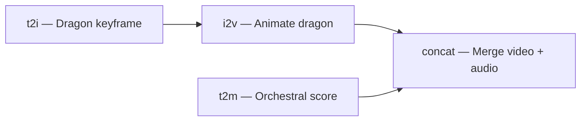
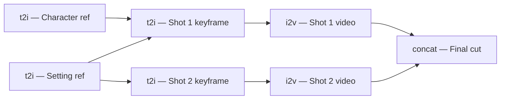

When you ask the Director to generate something, it creates a **Production Plan** — a directed acyclic graph (DAG) of media operation nodes and edges. This guide explains how plans are structured, how steps depend on each other, how parallel execution works, and how to track progress.

---

## What is a Production Plan?

A production plan is a set of **steps** (nodes) and **dependencies** (edges) presented as a card in the chat. For example, asking for _"A video of a dragon flying with orchestral background music"_ produces:

Steps that have no dependency on each other run **in parallel**. Steps that require an upstream result wait until that result is ready before starting.

---

## Step Types

Each step in a plan has an **operation** that determines what the executor will call:

| Operation | Name | Description |
|---|---|---|
| `t2i` | Text to Image | Generate a still image from a text prompt |
| `i2i` | Image to Image | Edit or composite an existing image |
| `t2v` | Text to Video | Generate a video clip from a text prompt |
| `i2v` | Image to Video | Animate an existing image into a video clip |
| `t2s` | Text to Speech | Convert a text script to spoken audio |
| `t2m` | Text to Music | Generate a music or audio track |
| `sfx` | Sound Effects | Generate a sound effects track |
| `concat` | Concatenate | Merge multiple video/audio clips into one |
| `edit` | Edit | Apply an edit operation to an existing asset |
| `upscale` | Upscale | Increase the resolution of an image |

---

## Edge Roles

Edges between steps have a **role** that tells the executor how to pass the upstream asset to the downstream step:

| Role | Meaning |
|---|---|
| `depends_on` | The upstream step's output is the primary input to the downstream step (e.g. the keyframe image feeds into the `i2v` animator) |
| `subject_ref` | The upstream asset is used as a **subject identity reference** — the downstream step will preserve the subject's appearance (face, costume, proportions) |
| `style_ref` | The upstream asset is used as a **visual style reference** — the downstream step will match the environment, lighting, color palette, and atmosphere |

A single step can receive multiple reference edges of different roles simultaneously.

---

## Approving a Plan

The plan appears as a card in the chat before any generation starts. You can:

- **Approve & Execute** — starts generation immediately
- **Ask for changes** — type a follow-up message ("make the video 8 seconds", "use portrait orientation") and the Director will revise the plan
- **Cancel** — dismiss the plan without generating anything

---

## Step Statuses

Once a plan is approved, each step tracks its own status in real time:

| Status | What's happening |
|---|---|
| **Queued** | Waiting for upstream dependencies to finish |
| **Generating** | The AI model is actively producing the asset |
| **Saving** | The generated file is being uploaded to your private cloud storage |
| **Completed** | The asset is ready and has appeared on the Canvas board |
| **Error** | The step failed; an error message is shown on the step card |

The plan approval card in the chat updates live as steps move through these states. Steps running in parallel show concurrent progress.

---

## Parallel Execution

FlowCraft uses a **topological sort** (Kahn's algorithm) on the dependency graph to determine which steps can run at the same time:

- Only `depends_on` edges create ordering constraints
- `subject_ref` and `style_ref` edges do **not** block execution — the referenced asset just needs to exist, not to have just finished
- Independent branches of the graph (e.g. music generation alongside image generation) always run in parallel

This means a 6-step multi-shot video production with 2 reference images, 2 keyframes, 2 animations, and 1 concat might look like:

Phases 0 references run first in parallel, then keyframes in parallel, then animations in parallel, then the concat waits for all animations.

---

## Text Cards (Scenario Documents)

For complex productions (short films, trailers, ads), the Director first emits a **text card** on the board before building the production plan. This scenario document contains:

- Visual style anchor: palette, light, textures, atmosphere
- Shot list: scene, subject, camera, duration, audio per shot
- Narrative structure labels: Hook, Build, Climax, Resolution

The text card gives you a chance to review and refine the creative direction before the Director commits to a full plan.

---

## Cloud Storage & Pre-warming

All generated assets are saved directly to your private Google Cloud Storage bucket.

- Access uses short-lived **signed URLs** so your media is never publicly exposed
- The system pre-warms these URLs immediately after each step completes, so cards appear on the board and load instantly without any delay
