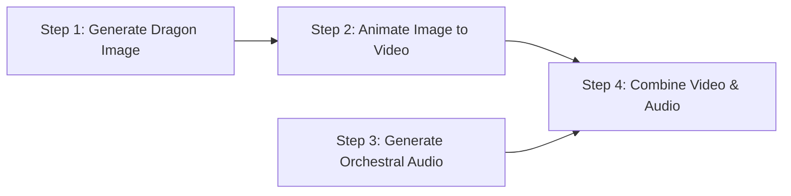

When you ask the AI Director for complex generation tasks, it creates a **Production Plan**. This plan outlines all the steps the AI needs to take to generate your final assets. This guide explains how plans are structured, how they execute, and how progress is tracked.

---

## 📋 What is a Production Plan?

A Production Plan is a series of interconnected cards (steps) shown in your chat. For example, if you ask for: _"A video of a dragon flying, with dramatic orchestral background music,"_ the Director will build a 2-step plan:

- **Step 1:** Generate the initial frame of the dragon (Gemini Image).
- **Step 2:** Animate the dragon image into a video clip (Veo 3.1).
- **Step 3:** Generate the matching orchestral music track (Lyria 3). Runs in parallel with Steps 1–2.
- **Step 4:** Merge the video and audio tracks together.

The Director automatically understands that Step 2 _depends on_ Step 1, while Step 3 can run independently in parallel!

---

## ⚡ Execution & Parallel Processing

Once you click **Approve & Execute**, FlowCraft's execution engine takes over:

- **Smart Ordering:** The engine calculates dependencies and runs independent steps at the same time to save you time.
- **Asset Hand-off:** Output files from upstream steps (like the dragon image) are automatically passed down as inputs to the next step (the video generator) without any manual file moving.

---

## 🟢 Real-Time Progress Tracking

While a plan is running, the visual cards on your Canvas Board and in the chat panel will update in real time:

1. **Queued:** The step is waiting for its dependencies to finish.
2. **Generating:** The AI model is currently rendering the text, image, or video.
3. **Saving:** The generated asset is being uploaded securely to your private cloud storage.
4. **Completed:** The final asset appears on your board, ready for you to download, view, or extend.

---

## 🔒 Cloud Storage & Pre-warming

All your generated media assets are saved directly to Google Cloud Storage.

- To ensure your files are secure, FlowCraft uses encrypted **signed URLs** to load images and videos in your browser.
- The system automatically "pre-warms" these links immediately after generation, so your assets load instantly on your board without lag.
