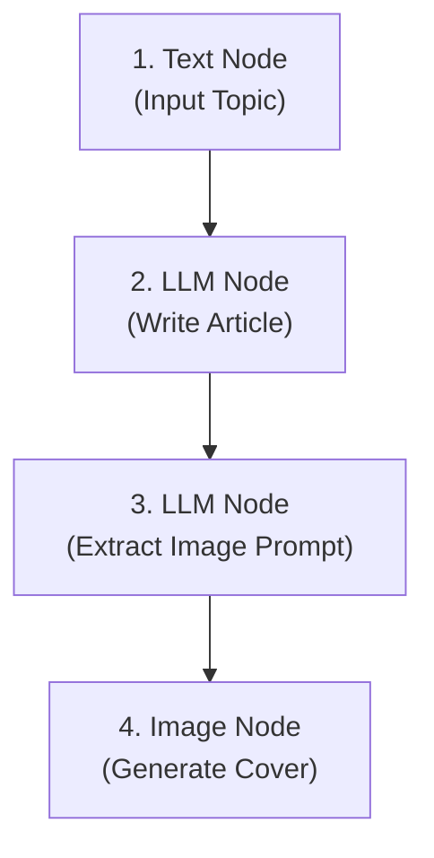

FlowCraft is designed to bring your creative ideas to life. In this guide, we walk you through two step-by-step tutorials—one for the **Flow Editor** and one for the **Canvas Workspace**—to give you ideas and inspiration for your own projects.

---

## 📝 Tutorial 1: Automatic Blog Post & Cover Image Generator (Flow Editor)

In this tutorial, you will build a node pipeline that automatically writes a blog post about a topic, extracts a main concept, and generates a corresponding cover image.

### 📐 Node Setup

We will connect four nodes in a line:

1. **Text Node:**
    - Set the text value to your blog topic (e.g., _"The future of vertical farming in smart cities"_).
    - Name this node `topic-node`.
2. **First LLM Node:**
    - Connect `topic-node` to this node.
    - Set **Instructions** to: _"Write a 300-word engaging blog post about [@topic-node]."_
    - Name this node `writer-node`.
3. **Second LLM Node:**
    - Connect `writer-node` to this node.
    - Set **Instructions** to: _"Based on the article: [@writer-node], write a highly detailed description of a single visual concept that represents it. This description will be used as a prompt for an AI image generator. Output only the prompt."_
    - Name this node `prompt-extractor`.
4. **Image Node:**
    - Connect `prompt-extractor` to this node.
    - Set the **Prompt** to: `[@prompt-extractor]`.
    - Set **Aspect Ratio** to **16:9**.

### 🏃 Running the Workflow

- Hover over the **Image Node** (the last node) and click **Run to here** in its action bar. FlowCraft will automatically execute the whole chain in dependency order: Text → LLM → LLM → Image.
- Watch the first LLM write the blog article, the second LLM extract a visual concept, and the Image Node generate a 16:9 cover image.
- **Result:** You now have a complete blog post and matching cover image in under 30 seconds!

---

## 🎬 Tutorial 2: Creating a Cinematic Film Scene (Canvas Workspace)

In this tutorial, you will collaborate with the AI Director to storyboard and generate a cinematic video clip with a custom sound effects track.

### 💬 Step-by-Step Chat Commands

1. **Describe the Setting:**
    - Type in chat: _"Generate a cinematic establishing shot of a futuristic research base sitting on the edge of a giant volcanic crater on Mars."_
    - **Director Action:** The Director will enrich your prompt and generate a stunning Martian landscape card on the Canvas Board.
2. **Animate the Scene:**
    - Click the 🎬 **Animate** button under the generated image in your chat.
    - Set the animation prompt: _"Slow camera pan showing magma glowing inside the crater."_
    - **Director Action:** The Director will run Google Veo to generate a 4-second panning video clip and place it on the board.
3. **Add Background Audio:**
    - Click the 🎵 **Add Music** button under the video clip.
    - Type in: _"dramatic cinematic sci-fi synthesizer pad with low volcanic rumbling sound effects"_
    - **Director Action:** The Director generates a matching audio track and links it to your Martian base video.
4. **Download and Share:**
    - Click on the final card on the board to view the merged video in fullscreen and download it to your computer.
