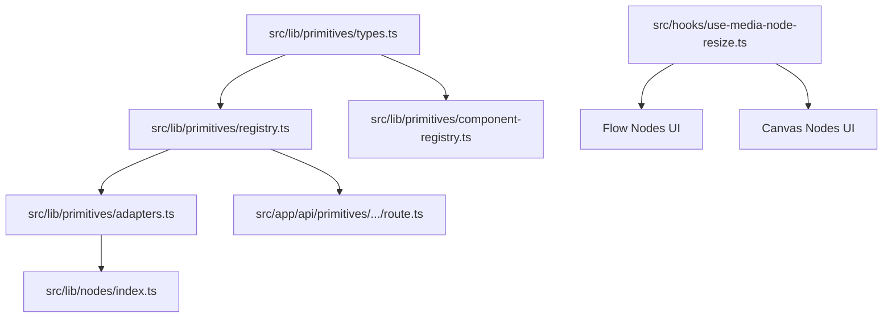

# Implementation Plan: Unified Primitive Registry Refactoring

## Overview

Decompose the Primitive Registry refactoring into five independently shippable phases. The core goal is to introduce a unified primitive system bottom-up, starting with interfaces and adapters, migrating existing primitives one by one, and finally wiring the registry directly into the execution engine and the agent layers.

---

## Architecture Decisions

- **Two-Registry Architecture**: Split execution/schema registry (`registry.ts` - server-safe, no React imports) from UI component registry (`component-registry.ts` - client-only React imports) to avoid Next.js bundle contamination.
- **Store-Agnostic Hook**: Consolidate resize hooks into `useMediaNodeResize` by passing an `onCommit` callback, separating UI/interaction logic from Zustand store updates.
- **Incremental Adapters**: Wrap primitive flow definitions using the `toNodeDefinition` adapter so they can be registered in the existing `src/lib/nodes/index.ts` alongside legacy definitions, enabling a safe, primitive-by-primitive migration.
- **Deprecated Facades**: Keep old API routes (e.g. `/api/generate-image`) as simple facade wrappers calling `registry.get(id).execute()` during migration. Delete only after the migration is fully completed and verified.

---

## Dependency Graph

---

## Task List

### Phase 1: Foundation

Introduce core types, registries, adapters, unified execution endpoints, and consolidate the resize hooks.

#### Task 1: Define Core Primitive Types & Registry

- **Description:** Implement `types.ts` declaring the main `Primitive` structure and the server-safe `registry.ts` class.
- **Acceptance criteria:**
    - `Primitive` interface supports sections for identity (`id`, `label`, `mediaType`), schema validation (`requestSchema`, `outputShape`), server execution (`execute`), flow configuration (`flow`), canvas configuration (`canvas`), and agent configuration (`agent`).
    - `PrimitiveRegistry` has `register`, `get`, `getByFlowType`, `getByCanvasType`, `flowTypes`, `canvasTypes`, `operationIds`, and `primitiveIds` methods.
- **Verification:**
    - `bun run check` type-checks cleanly.
- **Dependencies:** None
- **Files likely touched:**
    - `src/lib/primitives/types.ts`
    - `src/lib/primitives/registry.ts`
- **Estimated scope:** Small (2 files)

#### Task 2: Implement Component Registry & Compatibility Adapter

- **Description:** Define the client-safe `ComponentRegistry` and the `toNodeDefinition` adapter function.
- **Acceptance criteria:**
    - `ComponentRegistry` maps primitive IDs to React components (`FlowNode`, `CanvasNode`, `ConfigPanel`).
    - `toNodeDefinition` adapter converts a server-safe `Primitive` definition into a legacy `NodeDefinition` compatible with the workflow engine.
- **Verification:**
    - `bun run check` type-checks cleanly.
- **Dependencies:** Task 1
- **Files likely touched:**
    - `src/lib/primitives/component-registry.ts`
    - `src/lib/primitives/adapters.ts`
- **Estimated scope:** Small (2 files)

#### Task 3: Unified Execution API Endpoint

- **Description:** Create the unified `/api/primitives/[primitiveId]/execute/route.ts` endpoint.
- **Acceptance criteria:**
    - Endpoint uses `withAuth` middleware and awaits Next.js 15 context params.
    - Resolves the primitive from the registry, parses input JSON against the primitive's `requestSchema`, calls `primitive.execute()`, and returns JSON output.
- **Verification:**
    - API endpoint compiles: `bun run check`.
- **Dependencies:** Task 1
- **Files likely touched:**
    - `src/app/api/primitives/[primitiveId]/execute/route.ts`
- **Estimated scope:** Small (1 file)

#### Task 4: Unified Media Resize Hook

- **Description:** Implement `useMediaNodeResize` to replace `useNodeResize` and `useCanvasNodeResize`.
- **Acceptance criteria:**
    - `useMediaNodeResize` accepts an `onCommit` callback which receives `{ width, height }` dimensions on mouse up.
    - Updates all existing flow node and canvas node call sites to use the new hook.
    - `use-node-resize.ts` and `use-canvas-node-resize.ts` are fully deleted.
- **Verification:**
    - `bun run check` and `bun run test` pass.
- **Dependencies:** None
- **Files likely touched:**
    - `src/hooks/use-media-node-resize.ts`
    - `src/hooks/use-node-resize.ts` (deleted)
    - `src/hooks/use-canvas-node-resize.ts` (deleted)
    - `src/components/nodes/custom-workflow-node.tsx`, `file-node.tsx`, `image-node.tsx`, `list-node.tsx`, `llm-node.tsx`, `resize-node.tsx`, `text-node.tsx`, `upscale-node.tsx`, `video-node.tsx`
    - `src/components/canvas/nodes/canvas-image-node.tsx`, `canvas-text-node.tsx`, `canvas-video-node.tsx`
- **Estimated scope:** Large (12+ files touched, simple replacements)

### Checkpoint: Foundation

- [ ] `bun run preflight` compiles and passes all checks.
- [ ] No regression or visual behavior changes in node resize functionality.

---

### Phase 2: Media Primitives Migration

Migrate the key media-generative primitives sequentially.

#### Task 5: Migrate "image" Primitive

- **Description:** Create the `image` primitive folder, register its definition, move components, and delete old files.
- **Acceptance criteria:**
    - Definition contains Imagen generation execution, Zod validation schemas, and flow/canvas/agent settings.
    - Flow node (`FlowNode.tsx`), config panel (`ConfigPanel.tsx`), and canvas node (`CanvasNode.tsx`) are registered.
    - Legacy `src/app/api/generate-image/route.ts` refactored as a facade forwarding to `imagePrimitive.execute`.
    - Old image node and configuration files deleted.
- **Verification:**
    - `bun run preflight` passes.
- **Dependencies:** Task 2, Task 3, Task 4
- **Files likely touched:**
    - `src/lib/primitives/image/definition.ts`, `FlowNode.tsx`, `CanvasNode.tsx`, `ConfigPanel.tsx`
    - `src/lib/nodes/index.ts`
    - `src/app/api/generate-image/route.ts`
    - Deletes legacy image component files.
- **Estimated scope:** Medium (5 files created, 4 files deleted)

#### Task 6: Migrate "video" Primitive

- **Description:** Implement `video` primitive and components, rewrite `/api/generate-video` facade.
- **Acceptance criteria:** Same as Task 5 but for video generation.
- **Verification:**
    - `bun run preflight` passes.
- **Dependencies:** Task 5
- **Estimated scope:** Medium

#### Task 7: Migrate "upscale" Primitive

- **Description:** Implement `upscale` primitive, components, and update API facade.
- **Acceptance criteria:** Same as Task 5 but for upscale operation.
- **Verification:**
    - `bun run preflight` passes.
- **Dependencies:** Task 6
- **Estimated scope:** Medium

#### Task 8: Migrate "resize" Primitive

- **Description:** Implement `resize` primitive, components, and update API facade.
- **Acceptance criteria:** Same as Task 5 but for resize operation.
- **Verification:**
    - `bun run preflight` passes.
- **Dependencies:** Task 7
- **Estimated scope:** Medium

### Checkpoint: Media Primitives

- [ ] Image, Video, Upscale, and Resize are fully driven by the new primitive system.
- [ ] Core canvas and flow editor functions work without regressions.

---

### Phase 3: Non-Media Primitives Migration

Migrate structural and text-based primitives that do not have a canvas component.

#### Task 9: Migrate "llm" Primitive

- **Description:** Move LLM generation logic to the `llm` primitive. It has `canvas: null` but carries an agent skill config.
- **Acceptance criteria:**
    - `llm` definition executes Gemini text generation.
    - Legacy `src/app/api/generate-text/route.ts` becomes a facade.
- **Verification:**
    - `bun run preflight` passes.
- **Dependencies:** Task 8
- **Estimated scope:** Medium

#### Task 10: Migrate Remaining Flow Primitives (text, file, list, router, workflow inputs/outputs)

- **Description:** Migrate all remaining flow-only primitives into the registry.
- **Acceptance criteria:**
    - Definitions are registered for `text`, `file`, `list`, `router`, `workflow-input`, `workflow-output`, and `custom-workflow`.
    - The top-level `config-panel.tsx` switch is replaced with a clean `componentRegistry.get()` lookup.
    - `src/lib/nodes/index.ts` exports only definitions derived via the adapter.
- **Verification:**
    - `bun run preflight` passes.
- **Dependencies:** Task 9
- **Estimated scope:** Large (many files moved, but code matches existing logic exactly)

### Checkpoint: Non-Media Primitives

- [ ] Core config-panel switcher contains zero hardcoded switches.
- [ ] Legacy node definitions are completely deleted.

---

### Phase 4: Agent & Engine Wiring

Connect the registry directly into the canvas ADK agent runner and workflow execution layers.

#### Task 11: Wire Registry into PromptEngineer and Agent Tools

- **Description:** Dynamic skill mapping and tool schema extraction from the registry.
- **Acceptance criteria:**
    - `SKILL_FOR_TYPE` hardcoding inside `prompt-engineer.ts` replaced with `primitive.agent.skillPath`.
    - `planProductionTool` in `tools.ts` derives its list of operation enum keys dynamically from `registry.operationIds()`.
- **Verification:**
    - Agent unit tests pass: `bun run test src/__tests__/unit/adk-tools.test.ts`.
- **Dependencies:** Task 10
- **Files likely touched:**
    - `src/lib/canvas/adk/prompt-engineer.ts`
    - `src/lib/canvas/adk/tools.ts`
- **Estimated scope:** Small

#### Task 12: Wire Registry into Canvas generation.ts

- **Description:** Replace step execution switches in `executePlan`.
- **Acceptance criteria:**
    - `executePlan` runs steps by resolving the primitive using `registry.getByCanvasType`, maps the step input, and calls `primitive.execute()` directly (no HTTP hop).
    - Handles the custom canvas `concat` operation by defining a `concat` primitive.
- **Verification:**
    - Canvas execution tests pass: `bun run test src/__tests__/unit/concat-generation.test.ts`.
- **Dependencies:** Task 11
- **Files likely touched:**
    - `src/lib/canvas/generation.ts`
- **Estimated scope:** Medium

#### Task 13: Wire Registry into Workflow Engine Merging and Saving

- **Description:** Remove switches from batch merging and library saving in `workflow-engine.ts`.
- **Acceptance criteria:**
    - `mergeResults` delegates to `primitive.flow.mergeResults`.
    - `saveToLibrary` delegates to `primitive.flow.saveToLibrary`.
- **Verification:**
    - Workflow engine tests pass.
- **Dependencies:** Task 10
- **Files likely touched:**
    - `src/lib/workflow-engine.ts`
- **Estimated scope:** Small

### Checkpoint: Agent & Engine Wiring

- [ ] Zero node-type or step-type hardcoded switches exist in prompt engineering, planning tools, canvas execution, or workflow engine.

---

### Phase 5: Verification & Deletion

Verify extensibility and cleanup deprecated code.

#### Task 14: Add "music" Primitive

- **Description:** Create `src/lib/primitives/music` containing definition and components, and register them.
- **Acceptance criteria:**
    - Music primitive operates correctly on the flow editor, configuration sidebar, and is exposed dynamically to the Director agent.
    - Zero edits made to core files (`workflow-engine.ts`, `prompt-engineer.ts`, etc.) to register the primitive.
- **Verification:**
    - `bun run preflight` passes.
- **Dependencies:** Task 13
- **Estimated scope:** Medium

#### Task 15: Facade API Route Cleanup

- **Description:** Delete old, deprecated API endpoints and finalize refactoring.
- **Acceptance criteria:**
    - Legacy routes (`/api/generate-image`, etc.) are removed.
- **Verification:**
    - Workspace compiles and tests pass cleanly.
- **Dependencies:** Task 14
- **Estimated scope:** Small

### Checkpoint: Complete

- [ ] Refactoring complete.
- [ ] Full preflight successfully completed.

---

## Risks and Mitigations

| Risk                                                | Impact | Mitigation                                                                                                                |
| --------------------------------------------------- | ------ | ------------------------------------------------------------------------------------------------------------------------- |
| Client components imported inside server components | High   | Registry is split into `registry.ts` (server-safe) and `component-registry.ts` (client-safe). Ensure absolute separation. |
| In-flight agent sessions fail on old operation IDs  | High   | Keep `primitive.agent.operationId` matching the historical chat strings (`"t2i"`, `"i2v"`, etc.).                         |
| High file conflict during long-running branches     | Med    | Migrate incrementally one PR/primitive at a time, landing updates into main branch frequently.                            |
| Aspect-ratio calculations drift during resize       | Med    | Implement and test the consolidated `useMediaNodeResize` hook in isolation before migrating layout renderers.             |

## Open Questions

- None.
