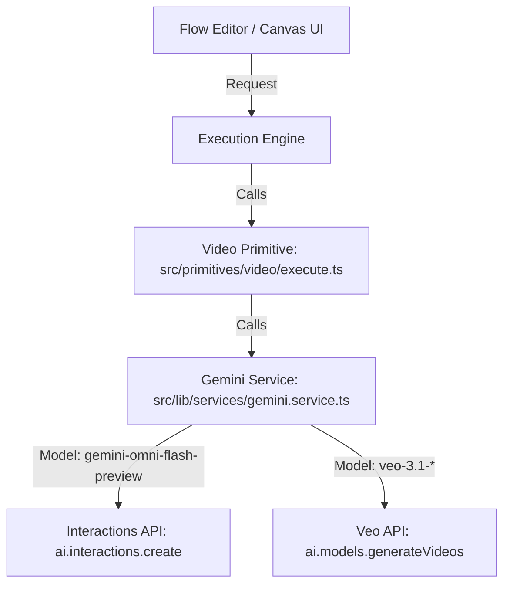

# Feature Spec: Gemini Omni Video Generation & Editing

This document outlines the design and implementation plan for integrating Gemini Omni Flash (`gemini-omni-flash-preview`) as the default video generation and editing model in FlowCraft.

---

## 1. Goals & Key Requirements

- **Model Integration**: Support `gemini-omni-flash-preview` for high-speed, high-quality video generation and editing.
- **New Default**: Make Gemini Omni the default model for both the **Flow Editor** and the **Agent Canvas**.
- **Multimodal Inputs**: Enable users to use images, audio references, and text prompts as inputs to generate new videos.
- **Conversational Editing**: Leverage the **Interactions API** to allow iterative, stateful video editing on the Agent Canvas.
- **720p Resolution**: Restrict the output resolution to 720p for the initial release.
- **No Explicit Duration**: Note that Omni's video duration is determined by the model/prompt, unlike Veo 3.1 which supports explicit duration parameters (4s, 6s, 8s).

---

## 2. Technical Design

### The Core: The Interactions API vs. Veo API

FlowCraft currently calls the Google Gen AI SDK's `models.generateVideos` for Veo 3.1. However, Gemini Omni Flash uses a different endpoint: the **Interactions API** (`ai.interactions.create`).

#### Veo 3.1 (Current)

```typescript
const operation = await ai.models.generateVideos({
    model: "veo-3.1-lite-generate-001",
    source: { prompt: "A sunset..." },
    config: { durationSeconds: 4, resolution: "720p" },
});
```

#### Gemini Omni (New)

```typescript
const interaction = await ai.interactions.create({
    model: "gemini-omni-flash-preview",
    input: [
        { type: "image", data: "base64_data", mime_type: "image/jpeg" }, // Reference Image
        {
            type: "text",
            text: "Turn this into a realistic video. Keep everything else the same.",
        },
    ],
    response_format: {
        type: "video",
        aspect_ratio: "16:9", // "16:9" or "9:16"
        delivery: "uri", // Recommended for videos > 4MB to avoid payload limits
    },
});
```

### 3. Architecture Integration

FlowCraft's clean architecture uses **Primitives** to encapsulate model-specific logic. We will implement Omni support by updating the **Video Primitive** (`src/primitives/video/`), the **Gemini Service** (`src/lib/services/gemini.service.ts`), and the **Zod Schemas** (`src/lib/schemas.ts`).



---

## 4. Detailed Component Impact

### A. Constants (`src/lib/constants.ts`)

1.  Add `GEMINI_OMNI_FLASH: "gemini-omni-flash-preview"` to `MODELS.VIDEO`.
2.  Update default video model references across the app to use `MODELS.VIDEO.GEMINI_OMNI_FLASH`.

### B. Schemas (`src/lib/schemas.ts`)

To prevent validation failures when selecting the new model, we must update the `GenerateVideoSchema`:

1.  Add `MODELS.VIDEO.GEMINI_OMNI_FLASH` to the `model` enum.
2.  Change the default model in the schema to `MODELS.VIDEO.GEMINI_OMNI_FLASH`.

```typescript
export const GenerateVideoSchema = z.object({
    // ... other fields
    model: z.preprocess(
        migrateVideoModel,
        z
            .enum([
                MODELS.VIDEO.VEO_3_1_LITE,
                MODELS.VIDEO.VEO_3_1_FAST,
                MODELS.VIDEO.VEO_3_1_PRO,
                MODELS.VIDEO.GEMINI_OMNI_FLASH, // Add this
            ])
            .optional()
            .default(MODELS.VIDEO.GEMINI_OMNI_FLASH), // Make it the new default
    ),
    // ... other fields
});
```

### C. Gemini Service (`src/lib/services/gemini.service.ts`)

We will update the `generateVideo` method or add a branching path to handle `gemini-omni-flash-preview`:

1.  **Branching Logic**: If the selected model is `gemini-omni-flash-preview`, route the request to the **Interactions API** (`this.ai.interactions.create`).
2.  **Multimodal Input Mapping**:
    - Map the text prompt, audio references, and reference images into the `input` array.
    - If `firstFrame` is provided, we can use the `<FIRST_FRAME>` tag in the prompt or map it appropriately.
3.  **Output & GCS Upload**:
    - Since the Interactions API returns either inline base64 or a Google-hosted file URI (via `delivery: "uri"`), we must download the video bytes and upload them to our GCS bucket using `storageService.uploadFile`.
    - _URI Delivery Polling_: For videos > 4MB, we will request `delivery: "uri"`, poll the file status until it is `ACTIVE`, download the bytes, and upload them to our GCS bucket to return a unified GCS URI.

### D. Video Primitive (`src/primitives/video/definition.ts`)

1.  **Default Data**: Change the default model to `MODELS.VIDEO.GEMINI_OMNI_FLASH`.
2.  **Input Gathering**:
    - Omni supports powerful prompt-based image roles. We can automatically compile connected image nodes into the `input` array and inject role tags into the prompt:
        - `firstFrame` -> Prepend `<FIRST_FRAME>` to the prompt.
        - `referenceImages` -> Bind to `<IMAGE_REF_0>`, `<IMAGE_REF_1>`, etc., in the prompt.
3.  **UI Config**:
    - When `gemini-omni-flash-preview` is selected, the UI should **disable/hide the duration slider** (as duration is not an API-configurable parameter for Omni) and **hide the 'Last Frame' input socket** (since Omni does not support frame interpolation).
    - **Audio References**: Enable the audio input socket and upload options when Omni is selected, but hide/disable them for Veo models.
    - Restrict resolution choices to `720p` only.

### E. Canvas & Director Agent (`src/lib/canvas/`)

The Director Agent (Agent B) can now perform **Conversational Video Editing**!

1.  **State Preservation**: Store the `interactionId` returned by the Interactions API in the canvas video node's metadata in Firestore.
2.  **Iterative Editing (Auto-Detection)**:
    - The execution engine (`executePlan` in `src/lib/canvas/generation.ts`) will automatically detect an edit when a video step depends on an existing video node (via a `depends_on` edge).
    - It will resolve the parent node's `interactionId` and pass it as `previous_interaction_id` to the Omni API, setting the task to `edit`.
3.  **Agent Awareness (Prompts & Skills)**:
    - Update the Director's system prompt (`src/lib/canvas/agent/prompts.ts`) and the video-generation skill doc (`src/lib/canvas/agent/skills/primitives/video-generation/SKILL.md`) to make the agent explicitly aware that stateful video editing is possible and is the default behavior when modifying video.

---

## 5. Key Discussion Points & Implications

### 1. Upstream API Limitations (Crucial for UX)

- **Audio References**: While Omni natively supports audio, the current API preview has limitations. We will enable the UI controls, but add clear error handling and tooltips to guide the user.
- **Video References**: The API accepts video references up to 3s in the schema, but the doc warns they _"are not correctly processed by the model at this time."_ We will mark video-to-video as an experimental/beta feature in the UI.

### 2. State Management for Canvas

- To support conversational editing, we must persist `interactionId` in Firestore. If a user closes the tab and reopens it, the Director must still be able to edit the video using the previous interaction ID.
- _Implementation_: Add `interactionId?: string` to `CanvasNode` metadata in `src/lib/canvas/types.ts` and ensure it is saved to Firestore.

### 3. GCS Upload Overhead

- Unlike Veo (which writes directly to our GCS bucket via `outputGcsUri`), Omni requires us to download the video (either from the response payload or from the Google Files API) and upload it to GCS ourselves.
- _Implication_: This will increase the execution time slightly due to the double-hop (Google -> Flowcraft Server -> GCS). We should ensure the serverless function timeout (`maxDuration`) is sufficient (currently 300s, which is plenty).

---

## 6. Next Steps

1.  **Update Schemas & Constants**: Update `src/lib/schemas.ts` and `src/lib/constants.ts` to register the new model.
2.  **Implement Gemini Service Changes**: Add `interactions.create` path and GCS upload logic in `gemini.service.ts`.
3.  **Update Video Primitive**: Update `definition.ts` and `execute.ts` to support the new model, input mapping, and UI constraints (hiding duration/last-frame, enabling audio).
4.  **Implement Canvas Editing**: Update the Director's tools, system prompts, and the canvas execution engine to support `previous_interaction_id` propagation.
5.  **Testing**: Write unit tests in `src/__tests__/` to validate the new executor path and input/output mapping.
